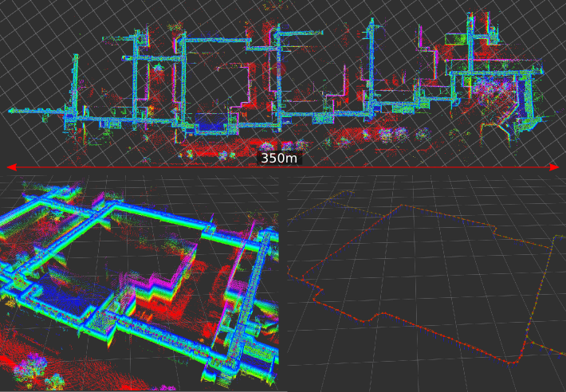
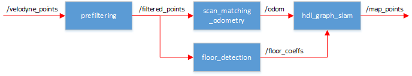
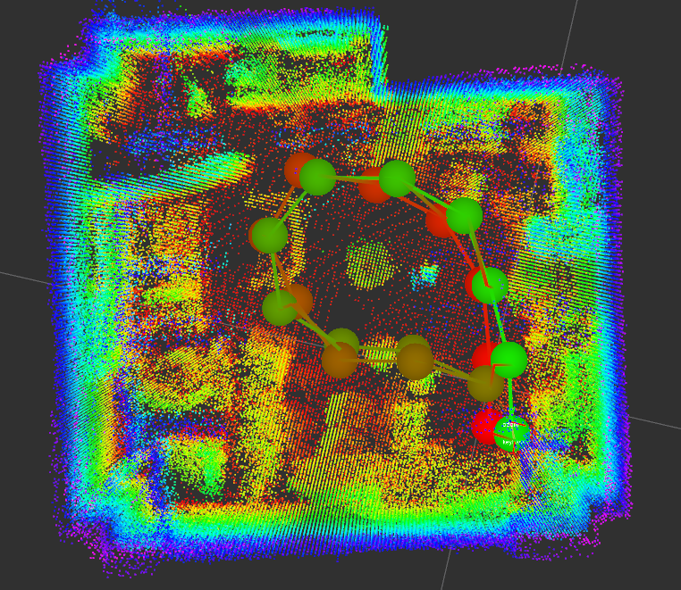
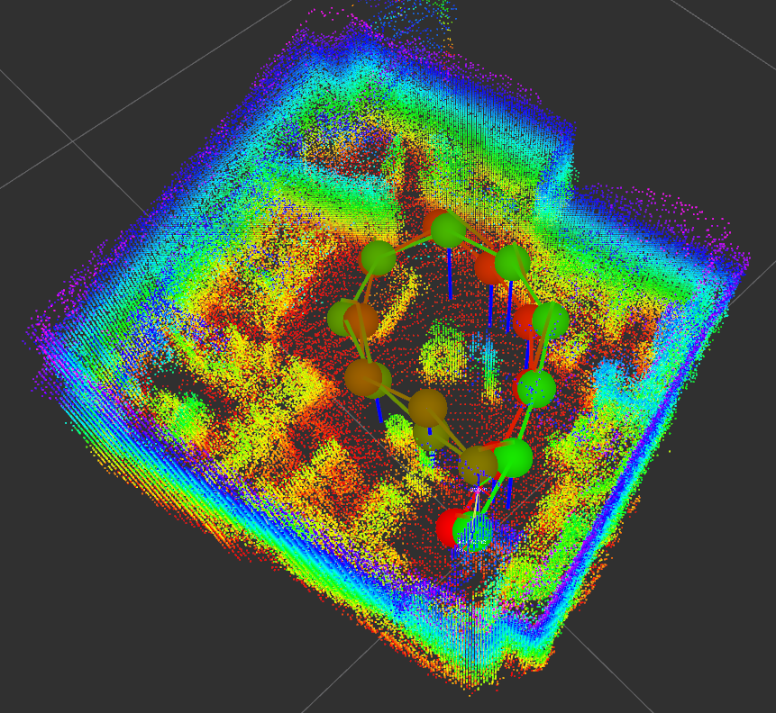
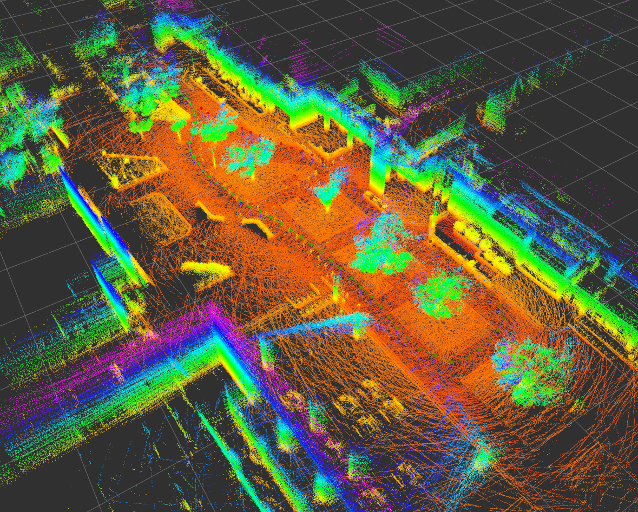
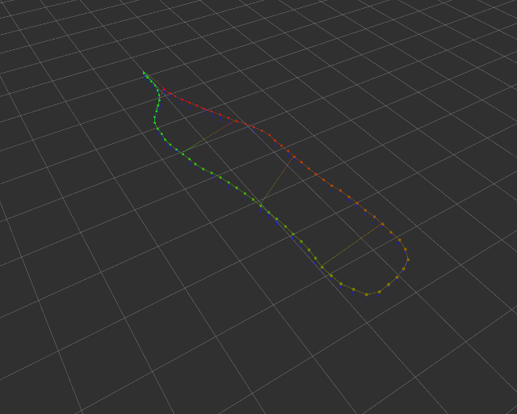
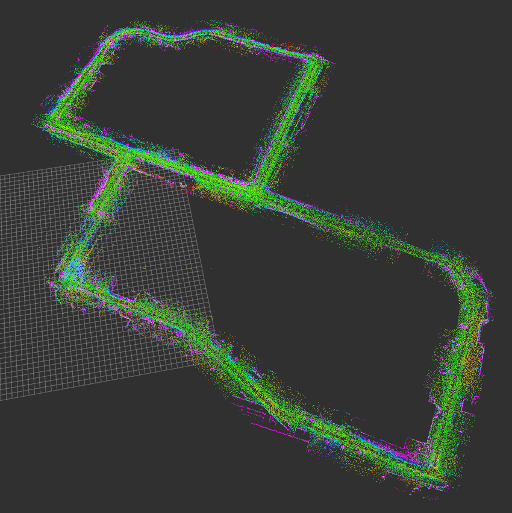
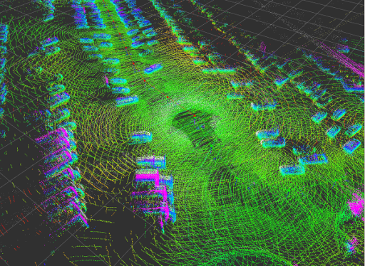
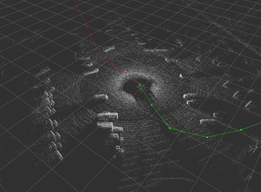
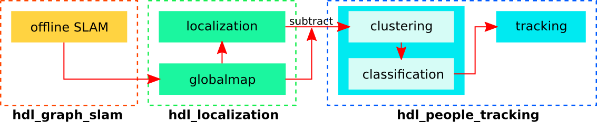

# hdl_graph_slam
***hdl_graph_slam*** is an open source ROS package for real-time 3D slam using a 3D LIDAR. It is based on 3D Graph SLAM with NDT scan matching-based odometry estimation and loop detection. It also utilizes floor plane detection to generate an environmental map with a completely flat floor. We have tested this packaged mainly in indoor environments, but it can be applied to outdoor environment mapping as well.



<a href="https://drive.google.com/open?id=0B9f5zFkpn4soSG96Tkt4SFFTbms">video</a>

## Nodelets
***hdl_graph_slam*** consists of four nodelets. 
- *prefiltering_nodelet*
- *scan_matching_odometry_nodelet*
- *floor_detection_nodelet*
- *hdl_graph_slam_nodelet*

The input point cloud is first downsampled by *prefiltering_nodelet*, and then passed to the next nodelets. While *scan_matching_odometry_nodelet* estimates the sensor pose by iteratively applying a scan matching between consecutive frames (i.e., odometry estimation), *floor_detection_nodelet* detects floor planes by RANSAC. The estimated odometry and the detected floor planes are sent to *hdl_graph_slam*. To compensate the accumulated error of the scan matching, it performs loop detection and optimizes a pose graph which takes odometry, loops, and floor planes into account.<br>

**[Sep/1/2017]** A GPS-based graph optimization has been implemented. *hdl_graph_slam_nodelet* receives GPS data (i.e., latitude, longitude) from */gps/geopoint* and converts them into the UTM coordinate, and then it adds them into the pose graph. It effectively compensate the scan matching error in outdoor environments.

<br>


### Parameters
All the parameters are listed in *launch/hdl_graph_slam.launch* as ros params.

### Services
- */hdl_graph_slam/dump*  (std_srvs/Empty)
  - save all data (point clouds, floor coeffs, odoms, and pose graph) to the current directory.
- */hdl_graph_slam/save_map*  (hdl_graph_slam/SaveMap)
  - save generated map as a PCD file.

## Requirements
***hdl_graph_slam*** requires the following libraries:
- OpenMP
- PCL 1.7
- g2o

Note that ***hdl_graph_slam*** cannot be built with older g2o libraries (such as ros-indigo-libg2o). ~~Install the latest g2o:~~
The latest g2o causes segfault. Use commit *a48ff8c42136f18fbe215b02bfeca48fa0c67507* instead of the latest one:

```bash
git clone https://github.com/RainerKuemmerle/g2o.git
cd g2o
git checkout a48ff8c42136f18fbe215b02bfeca48fa0c67507
mkdir build && cd build
cmake .. -DCMAKE_BUILD_TYPE=RELEASE
make -j8
sudo make install
```

The following ROS packages are required:
- geodesy
- nmea_msgs
- pcl_ros
- <a href="https://github.com/koide3/ndt_omp">ndt_omp</a>
```bash
sudo apt-get install ros-indigo-geodesy ros-indigo-pcl_ros ros-indigo-nmea-msgs

cd catkin_ws/src
git clone https://github.com/koide3/ndt_omp.git
```

**[optional]** *bag_player.py* script requires ProgressBar2.
```bash
sudo pip install ProgressBar2
```

## Example1 (Indoor)

Example bag files (recorded in a small room): 
- [hdl_501.bag.tar.gz](http://www.aisl.cs.tut.ac.jp/databases/hdl_graph_slam/hdl_501.bag.tar.gz) (raw data, 344MB)
- [hdl_501_filtered.bag.tar.gz](http://www.aisl.cs.tut.ac.jp/databases/hdl_graph_slam/hdl_501_filtered.bag.tar.gz) (downsampled data, 57MB, **Recommended!**)

```bash
rosparam set use_sim_time true
roslaunch hdl_graph_slam hdl_graph_slam_501.launch
```

```bash
roscd hdl_graph_slam/rviz
rviz -d hdl_graph_slam.rviz
```

```bash
rosbag play --clock hdl_501_filtered.bag
```

We also provide bag_player.py which adjusts the playback speed according to the processing speed of your PC. It allows processing data as fast as possible for your PC.

```bash
rosrun hdl_graph_slam bag_player.py hdl_501_filtered.bag
```

You'll see a generated point cloud like:

  

You can save the generated map by:
```bash
rosservice call /hdl_graph_slam/save_map "resolution: 0.05
destination: '/full_path_directory/map.pcd'"
```

## Example2 (Outdoor)

Bag file (recorded in an outdoor environment): 
- [hdl_400.bag.tar.gz](http://www.aisl.cs.tut.ac.jp/databases/hdl_graph_slam/hdl_400.bag.tar.gz) (raw data, about 900MB)


```bash
rosparam set use_sim_time true
roslaunch hdl_graph_slam hdl_graph_slam_400.launch
```

```bash
roscd hdl_graph_slam/rviz
rviz -d hdl_graph_slam.rviz
```

```bash
rosbag play --clock hdl_400.bag
```


  


## Example with GPS feature
Ford Campus Vision and Lidar Data Set <a href="http://robots.engin.umich.edu/SoftwareData/Ford">[URL]</a>.

The following script converts the Ford Lidar Dataset to a rosbag and plays it. In this example, ***hdl_graph_slam*** utilized the GPS data to correct the pose graph.

```bash
cd IJRR-Dataset-2
rosrun hdl_graph_slam ford2bag.py dataset-2.bag
rosrun hdl_graph_slam bag_player.py dataset-2.bag
```

  

## Common Problems

### hdl_graph_slam_nodelet causes memory error

It has been reported that *hdl_graph_slam_nodelet* causes a memory error in some environments. I found that this is caused by a variable (*color*) in g2o::VertexPlane. Since this field is used for only visualization, we can remove it from vertex_plane.h and vertex_plane.cpp in g2o. I made a clone repository of g2o, in which I just removed it
 from the commit *a48ff8c42136f18fbe215b02bfeca48fa0c67507* of g2o. If you face this memory error problem, try to install it instead of the original g2o repository. Do not forget to checkout *hdl_graph_slam* branch.

```bash
git clone https://github.com/koide3/g2o.git
cd g2o
git checkout hdl_graph_slam
mkdir build && cd build
cmake .. -DCMAKE_BUILD_TYPE=RELEASE
make -j8
sudo make install
```

### hdl_graph_slam in docker

If you still face the error, try our docker environment. You can build the docker image for *hdl_graph_slam* with: 

```bash
roscd hdl_graph_slam/docker
sudo docker build --tag hdl_graph_slam .
```

After building the image, you can launch hdl_graph_slam with:

```bash
sudo docker run -it --net=host --rm hdl_graph_slam bash
source /root/catkin_ws/devel/setup.bash
roslaunch roslaunch hdl_graph_slam hdl_graph_slam.launch
```

## Related packages

- <a href="https://github.com/koide3/hdl_graph_slam">hdl_graph_slam</a>
- <a href="https://github.com/koide3/hdl_localization">hdl_localization</a>
- <a href="https://github.com/koide3/hdl_people_tracking">hdl_people_tracking</a>




## Papers
Kenji Koide, Jun Miura, and Emanuele Menegatti, A Portable 3D LIDAR-based System for Long-term and Wide-area People Behavior Measurement, IEEE Transactions on Human-Machine Systems (under review) [PDF].

## Contact
Kenji Koide, Active Intelligent Systems Laboratory, Toyohashi University of Technology <a href="http://www.aisl.cs.tut.ac.jp">[URL]</a> <br>
koide@aisl.cs.tut.ac.jp

